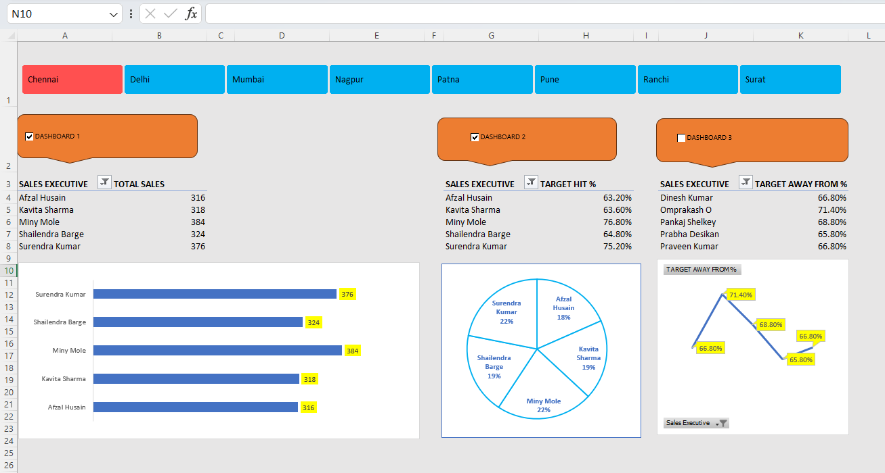

# Sales Executive Dashboard — Excel Project

An interactive Sales Executive Dashboard built in Microsoft Excel using Pivot Tables, Slicers, Charts, and VBA automation to track sales performance, target achievement, and regional breakdowns dynamically.

---

## Dashboard Preview



---

## Problem Statement

Sales managers need a quick, dynamic view of how executives are performing against targets — broken down by region and metric. This dashboard provides that in a single Excel file with no external dependencies, making it portable and easy to share across teams.

---

## Features

**Interactive Region Filter**
Filter all charts simultaneously by city (Chennai, Delhi, Mumbai, etc.) using a single slicer.

**3 Dashboard Views via Checkboxes**
- Dashboard 1 — Total Sales
- Dashboard 2 — Target Hit %
- Dashboard 3 — Target Away %

Each dashboard can be enabled or disabled independently using checkboxes, keeping the view clean.

**Visualizations**
- Bar Chart — Sales comparison across executives
- Pie Chart — Target distribution
- Line Chart — Target gap trend

**VBA Automation**
Checkboxes are linked to cells. A macro dynamically connects or disconnects Pivot Tables from the slicer based on checkbox state — so only the active dashboard responds to filtering.

---

## VBA Logic

```vba
Sub Macro3()

    If Sheet3.Range("A1").Value = True Then
        ActiveWorkbook.SlicerCaches("Slicer_Region1").PivotTables.AddPivotTable _
            ActiveSheet.PivotTables("PivotTable1")
    Else
        ActiveWorkbook.SlicerCaches("Slicer_Region1").PivotTables.RemovePivotTable _
            ActiveSheet.PivotTables("PivotTable1")
    End If

    If Sheet3.Range("D1").Value = True Then
        ActiveWorkbook.SlicerCaches("Slicer_Region1").PivotTables.AddPivotTable _
            ActiveSheet.PivotTables("PivotTable3")
    Else
        ActiveWorkbook.SlicerCaches("Slicer_Region1").PivotTables.RemovePivotTable _
            ActiveSheet.PivotTables("PivotTable3")
    End If

    If Sheet3.Range("G1").Value = True Then
        ActiveWorkbook.SlicerCaches("Slicer_Region1").PivotTables.AddPivotTable _
            ActiveSheet.PivotTables("PivotTable4")
    Else
        ActiveWorkbook.SlicerCaches("Slicer_Region1").PivotTables.RemovePivotTable _
            ActiveSheet.PivotTables("PivotTable4")
    End If

    If Sheet3.Range("J1").Value = True Then
        ActiveWorkbook.SlicerCaches("Slicer_Region1").PivotTables.AddPivotTable _
            ActiveSheet.PivotTables("PivotTable5")
    Else
        ActiveWorkbook.SlicerCaches("Slicer_Region1").PivotTables.RemovePivotTable _
            ActiveSheet.PivotTables("PivotTable5")
    End If

End Sub
```

**What this does:** Checks each checkbox cell value (TRUE/FALSE) and connects or disconnects the corresponding Pivot Table from the region slicer — making each dashboard view fully independent and dynamic.

---

## Tech Stack

| Tool | Purpose |
|---|---|
| Microsoft Excel | Dashboard, Pivot Tables, Charts, Slicers |
| VBA (Visual Basic for Applications) | Dynamic slicer-pivot table control |

---

## Project Structure

```
Excel_sales_executive_project/
├── sales_executive project.xlsm    # Main Excel file with dashboard and macros
├── dashboard_sales.png             # Dashboard screenshot
└── README.md
```

---

## Key Learnings

- Advanced Excel dashboard design with multiple views
- Slicer and Pivot Table integration across sheets
- VBA automation for dynamic dashboard control
- Data visualization best practices in Excel

---

## Use Cases

- Sales performance tracking and reporting
- Interview portfolio project demonstrating Excel + VBA skills
- Template for business reporting dashboards

---

## Author

Atharva Mohite
B.Tech Student — DY Patil University (RAIT), Expected 2027
Specialisation: Machine Learning · Data Science · NLP
GATE 2026 Qualified — Data Science & AI (AIR 7007)
[GitHub](https://github.com/MOHITEhere) | [LinkedIn](https://linkedin.com/in/<your-profile>)
